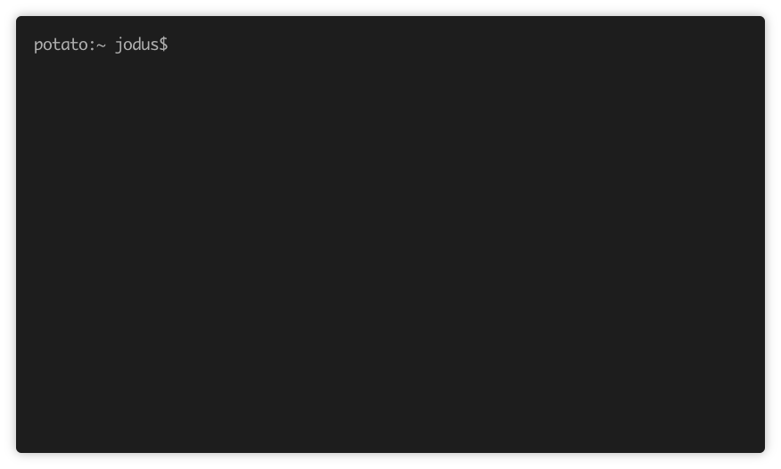

# bladwijzers
A handy CLI tool to manage your bookmarks.

```bash
> npm install -g bladwijzers
```

## Demo


## Requirements
* [Nodejs](https://nodejs.org/en/)

## Usage
```
Usage: bladwijzers [options] [command]

CLI bookmark organizer

Options:
  -h, --help  output usage information

Commands:
  add <url>   Add a new bookmark
  remove      Remove a bookmark
  open        Open a bookmark
  list        List all bookmarks
```
